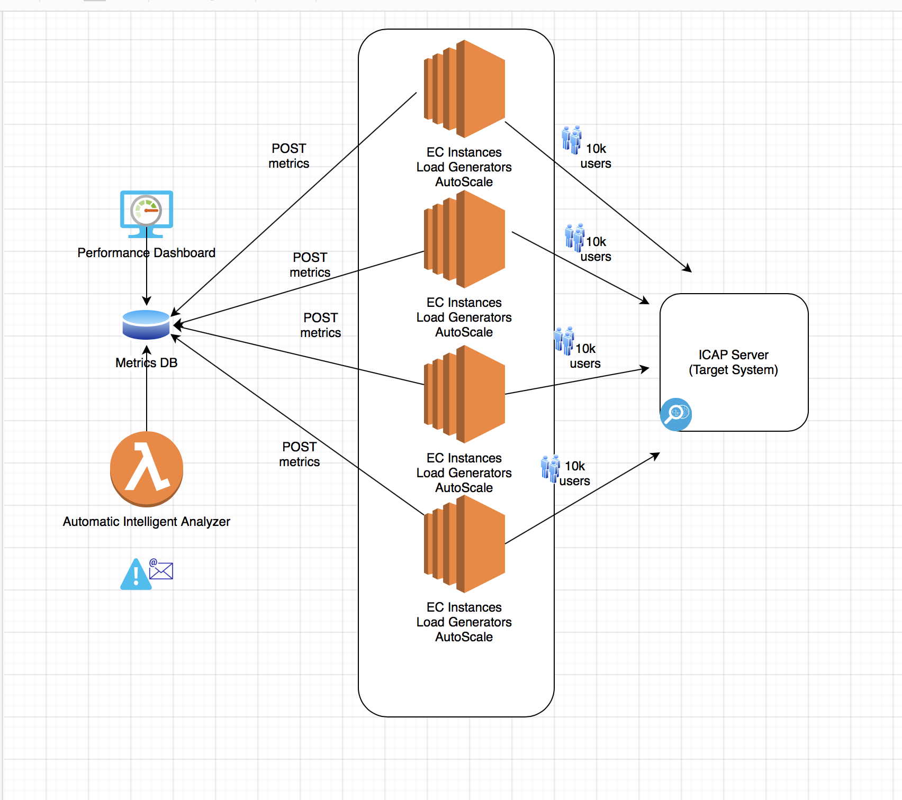

# How Jmeter ICAP Script works

## End 2 end flow vision
The end goal of the overall full solution is visioned to look like this:



## How JMeter Script works?

Jmeter script is designed to make things simple and use that simple approach to be able to generate load to ICAP server.

It basically 
- takes files from a s3 bucket in folder
- places them in local jmeter bin/in folder
- stores output files in jmeter bin/out folder
- copies those output files from jmeter bin/out folder to a bucker out folder 

There is files.txt file that contains list of file names that need to be uploaded to ICAP server.

## What is pre-requisite to run the Jmeter script
- download jar files from lib folder in this github report for this project and put them in jmeter lib folder in load generator machines
- Install AWS cli client in machine where jmeter is hosted (if the client does not exist)
    - https://docs.aws.amazon.com/cli/latest/userguide/install-linux-al2017.html
- Create AWS access and secret key that has access to s3 (read/write)
- Run "aws configure" and enter details 
- Obviously, ensure that at least java 8 and latest version Jmeter are installed
- create 2 folders in jmeter bin folder: in and out
- create s3 bucket and create in and out folders in that bucket
- Install icap test client
    - https://github.com/filetrust/program-icap/wiki/Using-the-C-ICAP-Test-Client


## How to run Jmeter script

run the following command:
```bash
[root@ip-172-31-85-184 bin]# sh jmeter.sh -n -t ICAP-POC_s3.jmx -l icaptest-s32.log
Creating summariser <summary>
Created the tree successfully using ICAP-POC_s3.jmx
Starting standalone test @ Fri Sep 25 04:10:00 UTC 2020 (1601007000933)
Waiting for possible Shutdown/StopTestNow/HeapDump/ThreadDump message on port 4445
```

To generate heavy load from Jmeter, we may need to tune it's heap memory, in such cases, we can set jmeter heap size like this

```bash
[root@ip-172-31-85-184 bin]# JVM_ARGS="-Xms1024m -Xmx1024m" sh jmeter.sh -n -t ICAP-POC_s3.jmx -l icaptest-s33.log
Creating summariser <summary>
Created the tree successfully using ICAP-POC_s3.jmx
Starting standalone test @ Fri Sep 25 04:12:37 UTC 2020 (1601007157810)
Waiting for possible Shutdown/StopTestNow/HeapDump/ThreadDump message on port 4445
```
We need to ensure that heap memory does not exceed available memory

There are several parameters in the script that can be changed during load tests
```bash
p_url=for icap server url: default is gw-icap01.westeurope.azurecontainer.io
p_bucket=bucket name for storing input and output files
p_inluxHost=influxdb IP address, default is localhost
p_vuserCount=number of concurrent users, default is 10
p_rampup= how many seconds to ramp up concurrent users, default is 20
p_duration=duration of test run in seconds,default is 600.
p_aws_access_key= aws access key, no default value. Must to use
p_aws_secret_key= aws secret key, no default value. Must to use
p_aws_region= region where bucket is created, default is us-east-1
```
For example, if we want to run, jmeter script with different bucket and influxdb host then it is run like this:
```bash
[root@ip-172-31-85-184 bin]# JVM_ARGS="-Xms1024m -Xmx1024m" sh jmeter.sh -n -t ICAP-POC_s3.jmx -Jp_aws_access=accesskeyhere -Jp_aws_secret_key=secretkeyhere -Jp_bucket=aws-testengine-s3 -Jp_influxHost=10.112.0.112 -l icaptest-s33.log
Creating summariser <summary>
Created the tree successfully using ICAP-POC_s3.jmx
Starting standalone test @ Fri Sep 25 04:12:37 UTC 2020 (1601007157810)
Waiting for possible Shutdown/StopTestNow/HeapDump/ThreadDump message on port 4445
```

