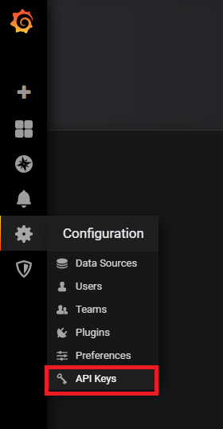
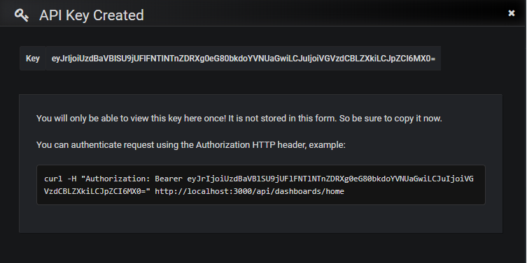

# Using CreateDashboard.py to Create Grafana Dashboards

## Introduction

Grafana allows you to create dashboards by sending HTTP post requests using their API. [An example post request for a new dashboard can be seen here.](https://grafana.com/docs/grafana/latest/http_api/dashboard/)

Dashboards creation can be automated using this method, and this is what is attempted with the CreateDashboard.py script.

## Prerequisites

In order to create dashboards using the Grafana API, a Grafana API Key must be generated on the machine hosting the dashboards. This can be done either via the Grafana UI or API.  [See here for how to create API keys using the Grafana API.](https://grafana.com/docs/grafana/latest/http_api/create-api-tokens-for-org/) The UI method is outlined below:

* Hover over the configuration icon on the left menu bar, select "API keys".



* Click "Add API Key" and enter a key name. The role can be either "Editor" or "Admin", both allow for dashboard creation ([See more on the difference between roles here](https://grafana.com/docs/grafana/latest/permissions/organization_roles/)).

* Click "Add" button.


* A popup containing the API key will appear. This is the only time this key will ever be visible, so it should be copied and stored somewhere safe.



This API Key is needed as a paramater to be passed to the CreateDashboard.py script that will be used to automate dashboard creation.

## Using CreateDashboard.py to Generate Dashboards


The script requires four command line arguments to run, these come in the form of options you provide (example runs are listed below). The required options are listed below:

<table>
<tr>
<td width="110"> Option </td> <td> Description </td>
</tr>
<tr>
<td> -u, --url </td>
<td>
The URL to the Grafana database's home page (for example, on your local machine that would typically be: "http://localhost:3000/"). This should be enclosed in quotations.
</td>
</tr>
<tr>
<td> -k, --key </td>
<td>
The API Key (discussed above).
</td>
</tr>
<tr>
<td> -f, --file </td>
<td>
Name/path of JSON file that will be used to create Grafana Dashboards. Paths should be enclosed in quotations.
</td>
</tr>
<tr>
<td> -p, --prefix </td>
<td>
This is provided for appending to measurements that will be displayed in the dashboards created. So whenever the script is run, prefixes can be provided to differentiate between measurements being fed to Grafana.
</td>
</tr>
</table>

## Example CreateDashboards.py Runs

A typical run should typically follow this format:
```bash
CreateDashboards.py -u "Grafana URL" -k <API Key> -f "Grafana Template File Name" -p "prefix of choice"
```
An example run from my local machine:
```bash
CreateDashboards.py -u "http://localhost:3000/" -k "eyJrIjoiR0ZXZmt1UFc0OEpIOGN5RWdUalBJTllUTk83VlhtVGwiLCJuIjoiYXBpa2V5Y3VybCIsImlkIjo2fQ==" -f "D:/Git Projects/aws-jmeter-test-engine-v1/jmeter-icap-poc/scripts/ICAP-Dashboard-4-grafana.json" -p "test-prefix"
```